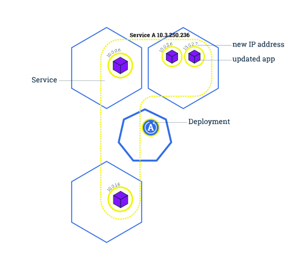

# Kubernetes 可以为您做些什么?

通过现代的 Web 服务，用户希望应用程序能够 24/7 全天候使用，开发人员希望每天可以多次发布部署新版本的应用程序。 容器化可以帮助软件包达成这些目标，使应用程序能够以简单快速的方式发布和更新，而无需停机。Kubernetes 帮助您确保这些容器化的应用程序在您想要的时间和地点运行，并帮助应用程序找到它们需要的资源和工具。Kubernetes 是一个可用于生产的开源平台，根据 Google 容器集群方面积累的经验，以及来自社区的最佳实践而设计。

# 1. 创建第一个集群

## 1.1 什么是 Kubernetes 集群

**Kubernetes 协调一个高可用计算机集群，每个计算机作为独立单元互相连接工作。** Kubernetes 中的抽象允许您将容器化的应用部署到集群，而无需将它们绑定到某个特定的独立计算机。为了使用这种新的部署模型，应用需要以将应用与单个主机分离的方式打包：它们需要被容器化。与过去的那种应用直接以包的方式深度与主机集成的部署模型相比，容器化应用更灵活、更可用。 **Kubernetes 以更高效的方式跨集群自动分发和调度应用容器。** Kubernetes 是一个开源平台，并且可应用于生产环境。

一个 Kubernetes 集群包含两种类型的资源:

- **Master** 调度整个集群
- **Nodes** 负责运行应用

*图. 集群图*


**Master 负责管理整个集群。** Master 协调集群中的所有活动，例如调度应用、维护应用的所需状态、应用扩容以及推出新的更新。

**Node 是一个虚拟机或者物理机，它在 Kubernetes 集群中充当工作机器的角色** 每个Node都有 Kubelet , 它管理 Node 而且是 Node 与 Master 通信的代理。 Node 还应该具有用于处理容器操作的工具，例如 Docker 或 rkt 。处理生产级流量的 Kubernetes 集群至少应具有三个 Node 。

在 Kubernetes 上部署应用时，您告诉 Master 启动应用容器。 Master 就编排容器在集群的 Node 上运行。 **Node 使用 Master 暴露的 Kubernetes API 与 Master 通信。**终端用户也可以使用 Kubernetes API 与集群交互。

Kubernetes 既可以部署在物理机上也可以部署在虚拟机上。您可以使用 Minikube 开始部署 Kubernetes 集群。 Minikube 是一种轻量级的 Kubernetes 实现，可在本地计算机上创建 VM 并部署仅包含一个节点的简单集群。 Minikube 可用于 Linux ， macOS 和 Windows 系统。Minikube CLI 提供了用于引导集群工作的多种操作，包括启动、停止、查看状态和删除。在本教程里，您可以使用预装有 Minikube 的在线终端进行体验。

## 1.2 创建集群

在预先安装 **Minikube** 的前提下，通过执行`minikube start`命令，Minikube 会启动一个虚拟机，并且在虚拟机中运行一个 Kubernetes 集群。

随后，可以通过执行`kubectl version`命令查看 Kubernetes server 是否在线，以及 Kubernetes client 和 server 的版本信息。

执行`kubectl cluster-info`可以检视集群的详细信息。执行`kubectl get nodes`查看集群中的节点信息。

# 2. 部署第一个应用程序

## 2.1 Kubernetes 部署

一旦运行了 Kubernetes 集群，就可以在其上部署容器化应用程序。 为此，您需要创建 Kubernetes **Deployment** 配置。Deployment 指挥 Kubernetes 如何创建和更新应用程序的实例。创建 Deployment 后，Kubernetes master 将应用程序实例调度到集群中的各个节点上。

创建应用程序实例后，Kubernetes Deployment 控制器会持续监视这些实例。 如果托管实例的节点关闭或被删除，则 Deployment 控制器会将该实例替换为群集中另一个节点上的实例。 **这提供了一种自我修复机制来解决机器故障维护问题。**

在没有 Kubernetes 这种编排系统之前，安装脚本通常用于启动应用程序，但它们不允许从机器故障中恢复。通过创建应用程序实例并使它们在节点之间运行， Kubernetes Deployments 提供了一种与众不同的应用程序管理方法。

*图. 部署你在 Kubernetes 上的第一个应用程序*


您可以使用 Kubernetes 命令行界面 **Kubectl** 创建和管理 Deployment。Kubectl 使用 Kubernetes API 与集群进行交互。在本单元中，您将学习创建在 Kubernetes 集群上运行应用程序的 Deployment 所需的最常见的 Kubectl 命令。

创建 Deployment 时，您需要指定应用程序的容器映像以及要运行的副本数。您可以稍后通过更新 Deployment 来更改该信息。

## 2.2 部署 APP

通过`kubectl create deployment`命令创建 deployment 配置。我们需要指定配置名和 APP 镜像地址。例如：

```
kubctl create deployment 'kubernetes-bootcamp' --image='gcr.io/google-samples/kubernetes-bootcamp:v1'
```

执行上面的命令，会为你做这些事情：

- 为部署应用查找合适的节点。（在示例环境中，只有1个节点）
- 调度应用到节点上运行。
- 配置集群以在需要的时候调度应用到新节点上。

执行`kubectl get deployments`列出 deployment 配置。

## 2.3 查看程序

在 Kubernetes 内部运行的 **Pods** 是运行在一个私有的、隔离的网络中。默认情况下，他们对于同一 Kubernetes 集群中的其他 pods 和 services 可见，网络外不可见。当我们使用`kubectl`时，是通过一个 API 端点在与我们的程序进行交互。

`kubectl`可以创建一个`proxy`，代理将通信转发到集群范围内的私有网络。通过`kubectl proxy`启动代理，启动后将独占终端窗口，并且不会有任何输出内容。启动后，我们的主机和集群之间就有了一个连接，我们将可以通过代理直接访问 API 端点。

例如，我们可以通过代理查询版本信息：

```
curl http://localhost:8001/version
```

API server 会自动基于 pod 名称为每个 pod 创建一个端点，这个端点同样可以通过代理访问。

首选，我们需要获取 pod 名称，我们可以将它保存在环境变量 **POD_NAME** 中：

```
export POD_NAME=$(kubectl get pods -o go-template --template '{{range .items}}{{.metadata.name}}{{"\n"}}{{end}}')
echo Name of the Pod: $POD_NAME
```

通过访问`$POD_NAME`端点，可以查看端点下提供的接口。例如执行：

```
curl http://localhost:8001/$(POD_NAME)
```

# 3. 查看 pod 和工作节点

## 3.1 Kubernetes Pods

pod 是Kubernetes 抽象出来的，表示一组一个或多个应用程序容器，以及这些容器的一些共享资源。共享资源包括：

- 共享存储，当作卷
- 网络，作为唯一的集群 IP 地址
- 有关每个容器如何运行的信息，例如容器映像版本或要使用的特定端口。

Pod 为特定于应用程序的“逻辑主机”建模，并且可以包含相对紧耦合的不同应用容器。例如，Pod 可能既包含带有 Node.js 应用的容器，也包含另一个不同的容器，用于提供 Node.js 网络服务器要发布的数据。Pod 中的容器共享 IP 地址和端口，始终位于同一位置并且共同调度，并在同一工作节点上的共享上下文中运行。

Pod是 Kubernetes 平台上的原子单元。 当我们在 Kubernetes 上创建 Deployment 时，该 Deployment 会在其中创建包含容器的 Pod （而不是直接创建容器）。**每个 Pod 都与调度它的工作节点绑定，并保持在那里直到终止（根据重启策略）或删除**。 如果工作节点发生故障，则会在群集中的其他可用工作节点上调度相同的 Pod。

***图.Pod概览***


## 3.2 工作节点

一个 pod 总是运行在 **工作节点** 上。工作节点是 Kubernetes 中的参与计算的机器，可以是虚拟机或物理计算机，具体取决于集群。每个工作节点由主节点管理。工作节点可以有多个 pod ，Kubernetes 主节点会自动处理在群集中的工作节点上调度 pod 。 主节点的自动调度考量了每个工作节点上的可用资源。

每个 Kubernetes 工作节点至少运行:

- Kubelet，负责 Kubernetes 主节点和工作节点之间通信的过程; 它管理 Pod 和机器上运行的容器。
- 容器运行时（如 Docker）负责从仓库中提取容器镜像，解压缩容器以及运行应用程序。

***图.工作节点概览***


## 3.3 使用 kubectl 进行故障排除

可以使用`kubectl`获取有关已部署的应用程序及其环境的信息。最常见的操作可以使用以下命令来完成：

- **kubectl get** - 列出资源
- **kubectl describe** - 显示有关资源的详细信息
- **kubectl logs** - 打印 pod 和其中容器的日志
- **kubectl exec** - 在 pod 中的容器上执行命令

您可以使用这些命令查看应用程序的部署时间，当前状态，运行位置以及配置。

### 3.3.1 查看应用配置

查看 pod 内有什么容器以及用于构建容器的镜像，可以执行`describe pods`命令：

```
kubectl describe pods
```

### 3.3.2 查看容器日志

通常，pod  内容器中的应用程序写入到`STDOUT`的任何内容都会变成日志。我们可以执行`kubectl logs`命令获取日志:

```
kubectl logs $POD_NAME
```

### 3.3.3 在容器上执行命令

一旦 pod 运行起来，我们就可以直接在容器上执行命令。为此，我们执行`exec`命令并以 Pod 名称作为参数。例如，列出环境变量：

```
kubectl exec $POD_NAME -- env
```

在容器里启动一个 bash 会话：

```
kubectl exec -ti $POD_NAME -- bash
```

# 4. 使用 service 暴露应用

## 4.1 Kubernetes Service 总览

Kubernetes [Pod](https://kubernetes.io/zh/docs/concepts/workloads/pods/) 是转瞬即逝的。 Pod 实际上拥有 [生命周期](https://kubernetes.io/zh/docs/concepts/workloads/pods/pod-lifecycle/)。 当一个工作 Node 挂掉后, 在 Node 上运行的 Pod 也会消亡。 [ReplicaSet](https://kubernetes.io/zh/docs/concepts/workloads/controllers/replicaset/) 会自动地通过创建新的 Pod 驱动集群回到目标状态，以保证应用程序正常运行。换一个例子，考虑一个具有3个副本数的用作图像处理的后端程序。这些副本是可替换的; 前端系统不应该关心后端副本，即使 Pod 丢失或重新创建。也就是说，Kubernetes 集群中的每个 Pod (即使是在同一个 Node 上的 Pod )都有一个惟一的 IP 地址，因此需要一种方法自动协调 Pod 之间的变更，以便应用程序保持运行。

Kubernetes 中的服务(Service)是一种抽象概念，它定义了 Pod 的逻辑集和访问 Pod 的协议。Service 使从属 Pod 之间的松耦合成为可能。 和其他 Kubernetes 对象一样, Service 用 YAML [(更推荐)](https://kubernetes.io/zh/docs/concepts/configuration/overview/#general-configuration-tips) 或者 JSON 来定义. Service 下的一组 Pod 通常由 *LabelSelector* (请参阅下面的说明为什么您可能想要一个 spec 中不包含`selector`的服务)来标记。

尽管每个 Pod 都有一个唯一的 IP 地址，但是如果没有 Service ，这些 IP 不会暴露在群集外部。Service 允许您的应用程序接收流量。Service 也可以用在 ServiceSpec 标记`type`的方式暴露：

- *ClusterIP* (默认) - 在集群的内部 IP 上公开 Service 。这种类型使得 Service 只能从集群内访问。
- *NodePort* - 使用 NAT 在集群中每个选定 Node 的相同端口上公开 Service 。使用`<NodeIP>:<NodePort>` 从集群外部访问 Service。是 ClusterIP 的超集。
- *LoadBalancer* - 在当前云中创建一个外部负载均衡器(如果支持的话)，并为 Service 分配一个固定的外部IP。是 NodePort 的超集。
- *ExternalName* - 通过返回带有该名称的 CNAME 记录，使用任意名称(由 spec 中的`externalName`指定)公开 Service。不使用代理。这种类型需要`kube-dns`的v1.7或更高版本。

更多关于不同 Service 类型的信息可以在[使用源 IP](https://kubernetes.io/zh/docs/tutorials/services/source-ip/) 教程。 也请参阅 [连接应用程序和 Service ](https://kubernetes.io/zh/docs/concepts/services-networking/connect-applications-service)。

另外，需要注意的是有一些 Service 的用例没有在 spec 中定义`selector`。 一个没有`selector`创建的 Service 也不会创建相应的端点对象。这允许用户手动将服务映射到特定的端点。没有 selector 的另一种可能是您严格使用`type: ExternalName`来标记。

## 4.2 Service 和 Label


Service 通过一组 Pod 路由通信。Service 是一种抽象，它允许 Pod 死亡并在 Kubernetes 中复制，而不会影响应用程序。在依赖的 Pod (如应用程序中的前端和后端组件)之间进行发现和路由是由Kubernetes Service 处理的。

Service 匹配一组 Pod 是使用 [标签(Label)和选择器(Selector)](https://kubernetes.io/zh/docs/concepts/overview/working-with-objects/labels), 它们是允许对 Kubernetes 中的对象进行逻辑操作的一种分组原语。标签(Label)是附加在对象上的键/值对，可以以多种方式使用:

- 指定用于开发，测试和生产的对象
- 嵌入版本标签
- 使用 Label 将对象进行分类

标签(Label)可以在创建时或之后附加到对象上。他们可以随时被修改。现在使用 Service 发布我们的应用程序并添加一些 Label 。

## 4.3 创建 Service

列出当前集群中的服务：

```
kubectl get services
```

创建一个新的 service 并且暴露它：

```
kubectl expose deployment/kubernetes-bootcamp --type="NodePort" --port 8080
```

查看对外暴露的什么端口：

```
kubectl describe services/kubernetes-bootcamp
```

创建值为 Node port 的环境变量`NODE_PORT`：

```
export NODE_PORT=$(kubectl get services/kubernetes-bootcamp -o go-template='{{(index .spec.ports 0).nodePort}}')
echo NODE_PORT=$NODE_PORT
```

现在，我们可以用节点IP和对外暴露的端口（Node port)来测试应用是否暴露成功：

```
curl $(minikube ip):$NODE_PORT
```

## 4.4 使用标签

Deployment 自动为 pod 创建一个标签。执行`describe deployment`指令可以查看标签名：

```
kubectl describe deployment
```

使用 label 查询 pods 列表：

```
kubectl get pods -l app=kubernetes-bootcamp
```

应用新的标签：

```
							obj_type	obj_name
kubectl label pod 			$POD_NAME version=v
```

## 4.5 删除 service

使用`delete service`命令可以删除服务，并且可以使用标签进行过滤：

```
kubectl delete service -l app=kubernetes-bootcamp
```

# 5. 缩放你的应用（运行应用的多个实例）

## 5.1 扩缩应用程序介绍

在之前的模块中，我们创建了一个 [Deployment](https://kubernetes.io/zh/docs/concepts/workloads/controllers/deployment/)，然后通过 [Service](https://kubernetes.io/zh/docs/concepts/services-networking/service/)让其可以开放访问。Deployment 仅为跑这个应用程序创建了一个 Pod。 当流量增加时，我们需要扩容应用程序满足用户需求。

**扩缩** 是通过改变 Deployment 中的副本数量来实现的。

*图.扩展描述*


扩展 Deployment 将创建新的 Pods，并将资源调度请求分配到有可用资源的节点上，收缩 会将 Pods 数量减少至所需的状态。Kubernetes 还支持 Pods 的[自动缩放](https://kubernetes.io/zh/docs/tasks/run-application/horizontal-pod-autoscale/)。将 Pods 数量收缩到0也是可以的，但这会终止 Deployment 上所有已经部署的 Pods。

运行应用程序的多个实例需要在它们之间分配流量。服务 (Service)有一种负载均衡器类型，可以将网络流量均衡分配到外部可访问的 Pods 上。服务将会一直通过端点来监视 Pods 的运行，保证流量只分配到可用的 Pods 上。

一旦有了多个应用实例，就可以没有宕机地滚动更新。

## 5.2 扩展应用

查看由 Deployment 创建的副本集，执行:

```
kubectl get rs
```

输出：

```
NAME                            DESIRED   CURRENT   READY   AGE
kubernetes-bootcamp-ccd8cdbf6   1         1         1       21h
```

其中，副本集的名称的格式为`[DEPLOYMENT-NAME]-[RANDOM-STRING]`。`RANDOM-STRING`是使用`pod-template-hash`作为 seed 随机生成的。

输出中有两个很重要的信息：

- `DESIRED`显示在创建 Deployment 时所定义的应用程序副本的期望数量。这是期望状态。
- `CURRENT` 显示当前有多少副本在运行。

使用`kubectl scale`命令缩放 Deployment，命令后跟 "deployment type", "name" 和 “desired number” 作为参数：

```
							deployment-type/name						desired-number
kubectl scale deployment/kubernetes-bootcamp --replicas=4
```

## 5.3 负载均衡检查

首先，对外暴露应用程序：

```
kubectl expose deployments/kubernetes-bootcamp --type="NodePort" --port=8080
```

然后多次通过暴露的 IP 和 port 访问应用程序：

```
curl $(minikube ip):$(NODE_PORT)
```

如果每次访问到不同的 Pod，代表负载均衡已经生效。

## 5.4 收缩应用

收缩应用：

```
kubectl scale deployments/kubernetes-bootcamp --replicas=2
```

# 6. 更新应用

## 6.1 更新应用程序

用户希望应用程序始终可用，而开发人员则需要每天多次部署它们的新版本。在 Kubernetes 中，这些是通过滚动更新（Rolling Updates）完成的。 **滚动更新** 允许通过使用新的实例逐步更新 Pod 实例，零停机进行 Deployment 更新。新的 Pod 将在具有可用资源的节点上进行调度。

在前面的模块中，我们将应用程序扩展为运行多个实例。这是在不影响应用程序可用性的情况下执行更新的要求。默认情况下，更新期间不可用的 pod 的最大值和可以创建的新 pod 数都是 1。这两个选项都可以配置为（pod）数字或百分比。 在 Kubernetes 中，更新是经过版本控制的，任何 Deployment 更新都可以恢复到以前的（稳定）版本。

*图.滚动更新概述*




与应用程序扩展类似，如果公开了 Deployment，服务将在更新期间仅对可用的 pod 进行负载均衡。可用 Pod 是应用程序用户可用的实例。

滚动更新允许以下操作：

- 将应用程序从一个环境提升到另一个环境（通过容器镜像更新）
- 回滚到以前的版本
- 持续集成和持续交付应用程序，无需停机

## 6.2 更新应用版本

查看应用所使用的当前的镜像的版本：

```
kubectl describe pods
```

查看`iamge`字段。

更新镜像版本，使用`set image`命令，后跟 "deployment name" 和 "new image version"：

```
kubectl set image deployments/kubernetes-bootcamp kubernetes-bootcamp=jocatalin/kubernetes-bootcamp:v2
```

该命令通知 Deployment 为应用使用新的镜像初始化滚动更新。

## 6.3 验证更新

除了可以通过访问应用和查看应用信息等方式验证更新外，还可以使用`rollout status`命令：

```
kubectl rollout status deployments/kubernetes-bootcamp
```

## 6.4 回滚更新

执行`rollout undo`命令可以将应用回滚到前一个工作版本：

```
kubectl rollout undo deployment/kubernetes-bootcamp
```

可以使用`rollout undo`命令让 Deployment 恢复到之前已经的状态，因为每一次更新，都是用版本标记过的。

查看更新的版本记录：

```
kubectl rollout history deployments/kubernetes-bootcamp
```

回滚到指定版本：

```
kubectl rollout undo deployments/kubernetes-bootcamp --to-revision=version
```

