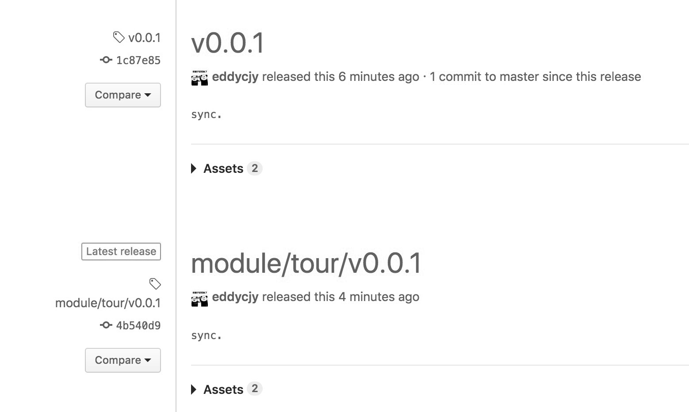
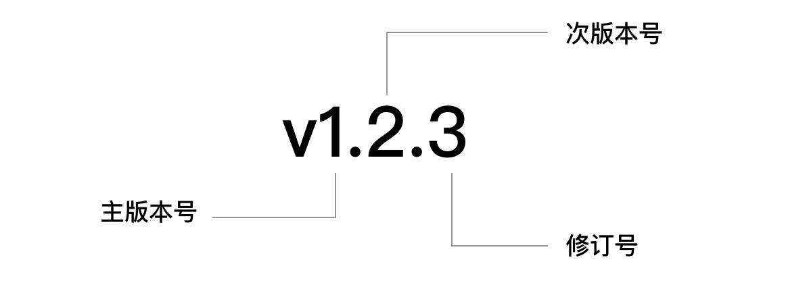

[TOC]


# 1. 基本使用

## 1.1 命令

| 命令            | 作用                           |
| --------------- | ------------------------------ |
| go mod init     | 初始化module，生成go.mod文件   |
| go mod download | 下载go.mod文件中指明的所有依赖 |
| go mod tidy     | 整理现有的依赖                 |
| go mod graph    | 查看现有依赖结构               |
| go mod edit     | 编辑go.mod文件                 |
| go mod vendor   | 导出项目所有的依赖到vendor目录 |
| go mod verify   | 检验一个依赖的模块是否被篡改过 |
| go mod why      | 查看为什么需要依赖某模块       |

## 1.2 环境变量

通过`go env` 查看，如下：

```sh
$ go env
GO111MODULE="auto"
GOPROXY="https://proxy.golang.org,direct"
GONOPROXY=""
GOSUMDB="sum.golang.org"
GONOSUMDB=""
GOPRIVATE=""
...
```

##### GO111MODULE

Go 语言提供了 GO111MODULE 这个环境变量来作为 Go modules 的开关，其允许设置以下参数：

- auto：只要项目包含了 go.mod 文件的话启用 Go modules，目前为默认值。
- on：启用 Go modules，推荐设置，将会是未来版本中的默认值。
- off：禁用 Go modules，不推荐设置。

##### GOPROXY

这个环境变量主要是用于设置 Go 模块代理（Go module proxy），其作用是用于使 Go 在后续拉取模块版本时能够脱离传统的 VCS 方式，直接通过镜像站点来快速拉取。

GOPROXY 的默认值是：`https://proxy.golang.org,direct`，这有一个很严重的问题，就是 `proxy.golang.org` 在国内是无法访问的，因此这会直接卡住你的第一步，所以你必须在开启 Go modules 的时，同时设置国内的 Go 模块代理，执行如下命令：

```shell
go env -w GOPROXY=https://goproxy.cn,direct
```

GOPROXY 的值是一个以英文逗号 “,” 分割的 Go 模块代理列表，允许设置多个模块代理，假设你不想使用，也可以将其设置为 “off” ，这将会禁止 Go 在后续操作中使用任何 Go 模块代理。

###### direct

“direct” 是一个特殊指示符，用于指示 Go 回源到模块版本的源地址去抓取（比如 GitHub 等），场景如下：当值列表中上一个 Go 模块代理返回 404 或 410 错误时，Go 自动尝试列表中的下一个，遇见 “direct” 时回源，也就是回到源地址去抓取，而遇见 EOF 时终止并抛出类似 “invalid version: unknown revision…” 的错误。

##### GOSUMDB

值是一个 Go checksum database，用于在拉取模块版本时（无论是从源站拉取还是通过 Go module proxy 拉取）保证拉取到的模块版本数据未经过篡改，若发现不一致，也就是可能存在篡改，将会立即中止。

GOSUMDB 的默认值为：`sum.golang.org`，在国内也是无法访问的，但是 GOSUMDB 可以被 Go 模块代理所代理（详见：Proxying a Checksum Database）。

若对 GOSUMDB 的值有自定义需求，其支持如下格式：

- 格式 1：`<SUMDB_NAME>+<PUBLIC_KEY>`。
- 格式 2：`<SUMDB_NAME>+<PUBLIC_KEY> <SUMDB_URL>`。

也可以将其设置为“off”，也就是禁止 Go 在后续操作中校验模块版本。

##### GONOPROXY/GONOSUMDB/GOPRIVATE

这三个环境变量都是用在当前项目依赖了私有模块，例如像是你公司的私有 git 仓库，又或是 github 中的私有库，都是属于私有模块，都是要进行设置的，否则会拉取失败。

更细致来讲，就是依赖了由 GOPROXY 指定的 Go 模块代理或由 GOSUMDB 指定 Go checksum database 都无法访问到的模块时的场景。

**而一般建议直接设置 GOPRIVATE，它的值将作为 GONOPROXY 和 GONOSUMDB 的默认值，所以建议的最佳姿势是直接使用 GOPRIVATE。**

它们的值都是一个以英文逗号 “,” 分割的模块路径前缀，也就是可以设置多个：

```sh
$ go env -w GOPRIVATE="git.example.com,github.com/eddycjy/mquote"
```

如果不想每次都重新设置，我们也可以利用通配符:

```sh
$ go env -w GOPRIVATE="*.example.com"
```

所有模块路径为 example.com 的子域名（例如：git.example.com）都将不经过 Go module proxy 和 Go checksum database，需要注意的是不包括 example.com 本身。

## 1.3 启用

目前 Go modules 并不是默认开启，因此 Go 语言提供了 GO111MODULE 这个环境变量来作为 Go modules 的开关。

如果你不确定你当前的值是什么，可以执行 `go env` 命令，查看结果：

```sh
$ go env
GO111MODULE="off"
...
```

如果需要对 GO111MODULE 的值进行变更，推荐通过 `go env` 命令进行设置：

```sh
 $ go env -w GO111MODULE=on
```

## 1.4 初始化项目

创建项目目录，比如：

```sh
$ mkdir -p $HOME/eddycjy/module-repo 
```

初始化 Go module，如下：

```sh
$ cd $HOME/eddycjy/module-repo
$ go mod init github.com/eddycjy/module-repo
go: creating new go.mod: module github.com/eddycjy/module-repo
```

## 1.5 查看 go.mod 文件

在初始化项目时，会生成一个 go.mod 文件，是启用了 Go modules 项目所必须的最重要的标识，同时也是 GO111MODULE 值为 auto 时的识别标识，它描述了当前项目（也就是当前模块）的元信息，每一行都以一个动词开头。

go.mod 文件内容举例如下：

```
// 定义模块路径
module github.com/eddycjy/module-repo

// 标识模块所用 go 语言版本
go 1.13

// 设置引用的特定的模块版本
require (
    example.com/apple v0.1.2
    example.com/banana v1.2.3
    example.com/banana/v2 v2.3.4
    example.com/pear // indirect 间接依赖，说明当前应用程序的 import 语句中没有发现对这个模块的明确引用
    example.com/strawberry // incompatible
)

// 排出一个特定的模块版本
exclude example.com/banana v1.2.4
// 替换一个模块版本到另一个模块版本
replace example.com/apple v0.1.2 => example.com/fried v0.1.0 
replace example.com/banana => example.com/fish
```

- module: 用于定义当前项目的模块路径
- go：用于表示当前模块的 Go 语言版本，值为初始化模块时的版本，目前来看还只是个标识作用。
- require：用于设置一个特定的模块版本。
- exclude：用于从使用中排出一个特定版本。
- replace：用于将一个模块版本替换为另外一个模块版本

另外你会发现 `example.com/pear` 的后面会有一个 indirect 标识，indirect 标识表示该模块为间接依赖，也就是在当前应用程序中的 import 语句中，并没有发现这个模块的明确引用，有可能是你先手动 `go get` 拉取下来的，也有可能是你所依赖的模块所依赖的，情况有好几种。

## 1.6 查看 go.sum 文件

在第一次拉取模块依赖后，会发现多出了一个 go.sum 文件，其详细罗列了当前项目直接或间接依赖的所有模块版本，并写明了那些模块版本的 SHA-256 哈希值以备 Go 在今后的操作中保证项目所依赖的那些模块版本不会被篡改。

go.sum 内容举例如下：

```
github.com/eddycjy/mquote v0.0.1 h1:4QHXKo7J8a6J/k8UA6CiHhswJQs0sm2foAQQUq8GFHM=
github.com/eddycjy/mquote v0.0.1/go.mod h1:ZtlkDs7Mriynl7wsDQ4cU23okEtVYqHwl7F1eDh4qPg=
github.com/eddycjy/mquote/module/tour v0.0.1 h1:cc+pgV0LnR8Fhou0zNHughT7IbSnLvfUZ+X3fvshrv8=
github.com/eddycjy/mquote/module/tour v0.0.1/go.mod h1:8uL1FOiQJZ4/1hzqQ5mv4Sm7nJcwYu41F3nZmkiWx5I=
...
```

可以看到一个模块路径可能有如下两种：

```
1. github.com/eddycjy/mquote v0.0.1 h1:4QHXKo7J8a6J/k8UA6CiHhswJQs0sm2foAQQUq8GFHM=
2. github.com/eddycjy/mquote v0.0.1/go.mod h1:ZtlkDs7Mriynl7wsDQ4cU23okEtVYqHwl7F1eDh4qPg=
...
```

情况“1”是 Go modules 将目标模块版本的 zip 文件开包后，针对所有包内文件依次进行 hash，然后再把它们的 hash 结果按照固定格式和算法组成总的 hash 值。

而 “1” 和 “2” 两者，要不就是同时存在，要不就是只存在 “2”。那什么情况下会不存在 “1” 呢，就是当 Go 认为肯定用不到某个模块版本的时候就会省略它的 hash，就会出现不存在 “1”，只存在 “2” 的情况。

## 1.7 查看全局缓存

拉取的模块缓存在 `$GOPATH/pkg/mod` 和 `$GOPATH/pkg/sumdb` 目录下，在`mod` 目录下会以`github.com/foo/bar` 的格式进行存放，如下：

```
mod
├── cache
├── github.com
├── golang.org
├── google.golang.org
├── gopkg.in
...
```

需要注意的是同一个模块版本的数据只缓存一份，所有其它模块共享使用。如果你希望清理所有已缓存的模块版本数据，可以执行 `go clean -modcache` 命令。

# 2. Go Modules 下的 go get 行为

在拉取项目依赖时，你会发现拉取的过程总共分为了三大步，分别是 finding（发现）、downloading（下载）以及 extracting（提取）， 并且在拉取信息上一共分为了三段内容：


需要注意的是，所拉取版本的 commit 时间是以 UTC 时区为准，而并非本地时区，同时我们会发现我们 `go get` 命令所拉取到的版本是 v0.0.0，这是因为我们是直接执行 `go get -u` 获取的，并没有指定任何的版本信息，由 Go modules 自行按照内部规则进行选择。

## 2.1 go get 的拉取行为

常用拉去命令如下：

| 命令              | 作用                                                         |
| :---------------- | :----------------------------------------------------------- |
| go get            | 拉取依赖，会进行指定性拉取（更新），并不会更新所依赖的其它模块。 |
| go get -u         | 更新现有的依赖，会强制更新它所依赖的其它全部模块，不包括自身。 |
| go get -u -t ./.. | 更新所有直接依赖和间接依赖的模块版本，包括单元测试中用到的。 |

拉取具体版本如下：

| 命令                            | 作用                                                    |
| ------------------------------- | ------------------------------------------------------- |
| go get golang.org/x/text@latest | 拉取最新的版本，若存在 tag，则优先使用。                |
| go get golang.org/x/text@master | 拉取 master 分支的最新 commit。                         |
| go get golang.org/x/text@v0.3.2 | 拉取 tag 为 v0.3.2 的 commit。                          |
| go get golang.org/x/text@342b2e | 拉取 hash 为 342b231 的 commit，最终会被转换为 v0.3.2。 |

## 2.2 go get 的版本选择

在 `go get` 没有指定任何版本的情况下，它的版本选择规则是怎么样的，也就是为什么 `go get` 拉取的是 `v0.0.0`，它什么时候会拉取正常带版本号的 tags 呢。实际上这需要区分两种情况，如下：

1. 所拉取的模块有发布tags：
   - 如果只有单个模块，那么就取主版本号最大的那个 tag。
   - 如果有多个模块，则推算相应的模块路径，取主版本号最大的那个 tag（子模块的 tag 的模块路径会有前缀要求）
2. 所拉取的模块没有发布过tags：
   - 默认取主分支最新一次 commit 的 commithash。

### 2.2.1 没有发布过tags

那么为什么会拉取的是 `v0.0.0` 呢，是因为所依赖模块没有发布任何的 tag。因此它默认取的是主分支最新一次 commit 的 commit 时间和 commithash，也就是 属于第二种情况。

### 2.2.2 有发布tags

在项目有发布 tags 的情况下，还存在着多种模式，也就是只有单个模块和多个模块，我们统一以多个模块来进行展示，因为多个模块的情况下就已经包含了单个模块的使用了，如下图：



示例项目中一共打了两个tag，分别是：v0.0.1 和 module/tour/v0.0.1。之所以会出现`module/tour/v0.0.1` 这么“奇怪”的 tag，是因为这是同一个项目下存在多个模块的tag表现方式。其主要目录结构为；

```
mquote
├── go.mod
├── module
│   └── tour
│       ├── go.mod
│       └── tour.go
└── quote.go
```

可以看到在 `mquote` 这个项目的根目录有一个 go.mod 文件，而在 `module/tour` 目录下也有一个 go.mod 文件，其模块导入和版本信息的对应关系如下：

| tag               | 模块倒入路径                          | 含义                                             |
| ----------------- | ------------------------------------- | ------------------------------------------------ |
| v0.0.1            | github.com/eddycjy/mquote             | mquote 项目的 v 0.0.1 版本                       |
| module/tour/v0.01 | github.com/eddycjy/mquote/module/tour | mquote 项目下的子模块 module/tour 的 v0.0.1 版本 |

### 2.2.3 导入主模块和子模块

结合上述内容，拉取主模块:

```
$ go get github.com/eddycjy/mquote@v0.0.1
go: finding github.com/eddycjy/mquote v0.0.1
go: downloading github.com/eddycjy/mquote v0.0.1
go: extracting github.com/eddycjy/mquote v0.0.1
```

而拉取子模块：

```shell
$ go get github.com/eddycjy/mquote/module/tour@v0.0.1
go: finding github.com/eddycjy/mquote/module v0.0.1
go: finding github.com/eddycjy/mquote/module/tour v0.0.1
go: downloading github.com/eddycjy/mquote/module/tour v0.0.1
go: extracting github.com/eddycjy/mquote/module/tour v0.0.1
```

我们将主模块和子模块的拉取进行对比，你会发现子模块的拉取会多出一步，它会先发现 `github.com/eddycjy/mquote/module`，再继续推算，最终拉取到 `module/tour`。

# 3. go modules 下的 go run/build 行为

在开启了 Go Modules 的情况下，原本的 go run 和 go build 命令也发生了一些改变。在执行这两个命令时，会首先根据项目下的 go mod 相关文件，查找并自动下载该项目所需的模块依赖，然后才运行和编译 Go 程序。

另外需要注意的是，假设你在一些特殊情况下，希望使用的项目下的 vendor 目录作为依赖，那么在执行 `go mod vendor` 生成了 vendor 目录后，你需要执行 `go build -mod=vendor` 才可以使用 vendor 作为依赖来编译，否则单纯执行 `go run` 或 `go build` 都是无法使用 vendor 的。

# 4. go modules 的导入路径说明

## 4.1 不同版本的导入路径

 Go modules 在主版本号为 v0 和 v1 的情况下省略了版本号，而在主版本号为 v2 及以上则需要明确指定出主版本号，否则会出现冲突，其 tag 与模块导入路径的大致对应关系如下：

| tag    | 导入路径                     |
| ------ | ---------------------------- |
| v0.0.0 | github.com/eddycjy/mquote    |
| v1.0.0 | github.com/eddycjy/mquote    |
| v2.0.0 | github.com/eddycjy/mquote/v2 |
| v3.0.0 | github.com/eddycjy/mquote/v3 |

简单来讲，就是主版本号为 v0 和 v1 时，不需要在模块导入路径包含主版本的信息，而在 v1 版本以后，也就是 v2 起，必须要在模块的导入路径末尾加上主版本号，引用时就需要调整为如下格式：

```go
import (
    "github.com/eddycjy/mquote/v2/example"
)
```

另外忽略主版本号 v0 和 v1 是强制性的（不是可选项），因此每个软件包只有一个明确且规范的导入路径。

## 4.2 为什么忽略 v0 和 v1 的主版本号

1. 导入路径中忽略 v1 版本的原因是：考虑到许多开发人员创建一旦到达 v1 版本便永不改变的软件包，这是官方所鼓励的，不认为所有这些开发人员在无意发布 v2 版时都应被迫拥有明确的 v1 版本尾缀，这将导致 v1 版本变成“噪音”且无意义。
2. 导入路径中忽略了 v0 版本的原因是：根据语义化版本规范，v0 的这些版本完全没有兼容性保证。需要一个显式的 v0 版本的标识对确保兼容性没有多大帮助。

# 5. go modules 语义化版本控制

我们不断地在 Go Modules 的使用中提到版本号，其实质上被称为“语义化版本”，假设我们的版本号是 v1.2.3，如下：



其版本格式为“主版本号.次版本号.修订号”，版本号的递增规则如下：

1. 主版本号：当你做了不兼容的 API 修改。
2. 次版本号：当你做了向下兼容的功能性新增。
3. 修订号：当你做了向下兼容的问题修正。

假设你是先行版本号或特殊情况，可以将版本信息追加到“主版本号.次版本号.修订号”的后面，作为延伸，如下：


至此我们介绍了 Go modules 所支持的两类版本号方式，在我们发布新版本打 tag 的时候，需要注意遵循，否则不遵循语义化版本规则的版本号都是无法进行拉取的。

# 6. go modules 的最小版本选择

一个模块往往依赖着许多其它许许多多的模块，并且不同的模块在依赖时很有可能会出现依赖同一个模块的不同版本，如下图（来自 Russ Cox）：


在上述依赖中，模块 A 依赖了模块 B 和模块 C，而模块 B 依赖了模块 D，模块 C 依赖了模块 D 和 F，模块 D 又依赖了模块 E，而且同模块的不同版本还依赖了对应模块的不同版本。那么这个时候 Go modules 怎么选择版本，选择的是哪一个版本呢？

我们根据 proposal 可得知，Go modules 会把每个模块的依赖版本清单都整理出来，最终得到一个构建清单，如下图（来自 Russ Cox）：


我们看到 rough list 和 final list，两者的区别在于重复引用的模块 D（v1.3、v1.4），其最终清单选用了模块 D 的 v1.4 版本，主要原因：

1. 语义化版本的控制：因为模块 D 的 v1.3 和 v1.4 版本变更，都属于次版本号的变更，而在语义化版本的约束下，v1.4 必须是要向下兼容 v1.3 版本，因此认为不存在破坏性变更，也就是兼容的。

2. 模块导入路径的规范：主版本号不同，模块的导入路径不一样，因此若出现不兼容的情况，其主版本号会改变，模块的导入路径自然也就改变了，因此不会与第一点的基础相冲突。

# 7. go.sum 文件要不要提交

理论上 go.mod 和 go.sum 文件都应该提交到你的 Git 仓库中去。

假设我们不上传 go.sum 文件，就会造成每个人执行 Go modules 相关命令，又会生成新的一份 go.sum，也就是会重新到上游拉取，再拉取时有可能就是被篡改过的了，会有很大的安全隐患，失去了与基准版本（第一个所提交的人，所期望的版本）的校验内容，因此 go.sum 文件是需要提交。

# 8. go list 的作用

我们常常会在使用 IDE 时，在底部会看到它在自动执行类似 `go list -m -u all` 的相关命令，但是我们自己在命令行实际使用的时候却往往比较少用到，那么 `go list` 命令的作用到底是什么呢，我们可以执行 `go help list` 命令进行查看，其命令格式如下：

```sh
go list [-f format] [-json] [-m] [list flags] [build flags] [packages]
```

- `-f`：用于查看对应依赖结构体中的指定的字段，其默认值就是 `{{.ImportPath}}`，也就是导入路径，因此我们一般不需要进行调整。
- `-json`：显示的格式，若不指定该选项，则会一行行输出。
- `-u`：显示能够升级的模块信息，例如：`cloud.google.com/go v0.26.0 [v0.55.0]`。
- `-m`：显示当前项目所依赖的全部模块。

